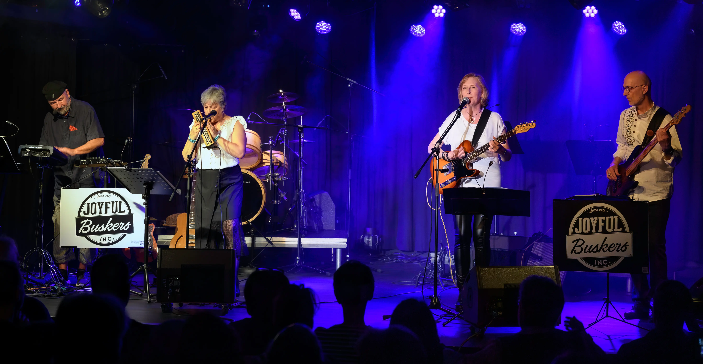

<h1 style="text-align:center">MERCI pour le 10ème anniversaire!</h1>

<figure>
    
    <figcaption>A l'Azimut, Estavayer-le-Lac, Mai 2025 - Copyright 2025 Azimut E.Humair</figcaption>
</figure>

Nous sommes très reconnaissants à la centaine  de personnes qui nous ont rejoint pour
notre concert décanniversaire du 17 mai 2025, à l'Azimut à Estavayer-le-Lac.

Une ambiance exceptionnelle, un public réceptif, une salle fantastique, des techniciens et bénévoles au top, une chouette première partie avec Vincent d'Ut, et un gâteau offert, que voudrait-on de plus!

Nous vous donnons rendez-vous à **Grandson le 4 juillet 2025** où nous animerons la 
célèbre [course des quais](https://gym-grandson.ch/gymgrandson/course-des-quais/)
à partir de 18h30 environ.

## On vient jouer chez vous!

Nous viendrons très volontiers jouer dans votre salon, votre jardin, votre restaurant
ou tout autre endroit insolite (ou pas) pour animer une fête, ou juste pour le plaisir. Toutes les
excuses sont bonnes! Utilisez le <a href="/allo-les-buskers">formulaire de contact</a>
pour nous écrire, et on en discute!

<figure>
    
    <figcaption>On vient jouer chez vous, ou bien?</figcaption>
</figure>

## La Lagune, Cheyres, Mai 2022

La vidéo ci-dessous montre la formation actuelle "Buskers de base" à quatre, nous avons aussi une variante à cinq musiciens avec Richard Rossier à la guitare si l'infrastructure et les disponibilités le permettent.



Notre répertoire de reprises pop & country "unplugged" (ou presque) a fait ses preuves depuis 2015, pour de nombreux concerts et événements en Suisse romande. Vous trouvez sur la page des [références](https://joyful-buskers.ch/references/) la liste des concerts publics que vous avez manqué ces dernières années.

## Alors, on cause?

Nous sommes à votre disposition pour des concerts, événements privés, fêtes de village, anniversaires (aussi dans votre salon ou votre jardin) et autres animations.

Vous pouvez aussi vous abonner à notre [page Facebook](http://facebook.com/joyful.buskers.inc) pour avoir les dernières nouvelles en live. Et il faudrait vraiment qu'on mette un peu plus de trucs sur
<a href="https://www.instagram.com/joyful.buskers.ch/">Instagram</a>.

En attendant, contactez-nous, c'est facile, grâce à notre merveilleux <a href="/allo-les-buskers">formulaire de contact</a> qui vous mettra en liaison avec notre merveilleuse Intelligence Naturelle (nous, quoi).

<!--

-->

#### Ce qu'ils en disent...














