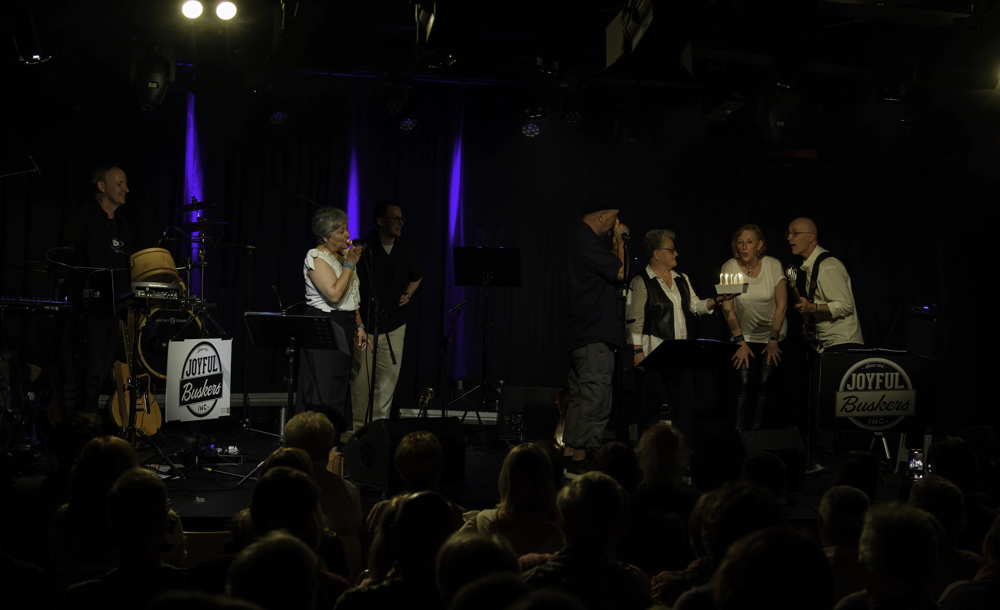
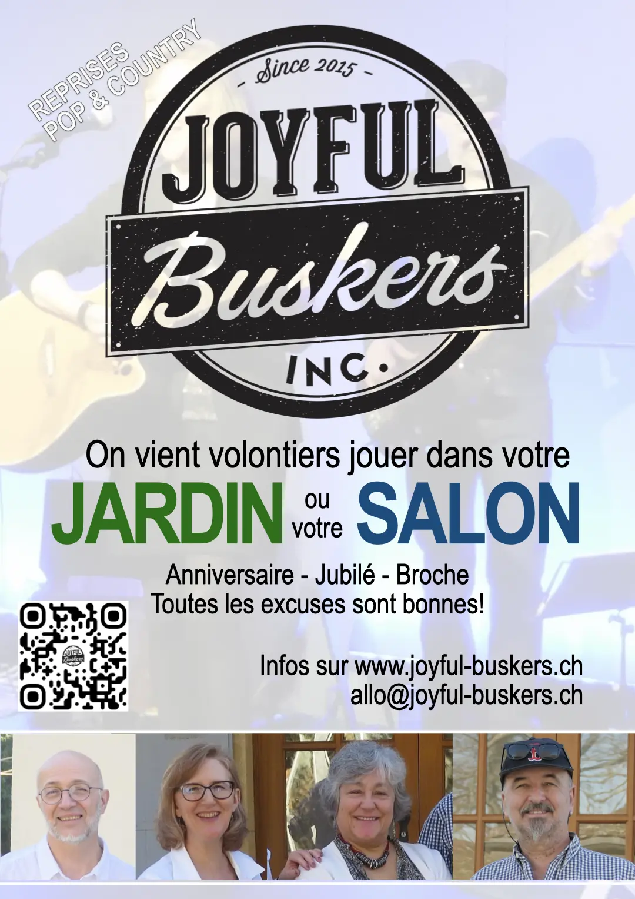

<h1 style="text-align:center">MERCI!</h1>

<figure>
    
    <figcaption>Le gâteau des dix ans, photo Eric Humair</figcaption>
</figure>

Nous sommes très reconnaissant à la centaine  de personnes qui nous ont rejoint pour
notre concert décanniversaire du 17 mai! Une ambiance exceptionnelle, un public réceptif,
une salle fantastique, des techniciens et bénévoles au top, et un gâteau offert, que
voudrait-on de plus!

Nous vous donnons rendez-vous à **Grandson le 4 juillet 2025** où nous animerons la 
célèbre [course des quais](https://gym-grandson.ch/gymgrandson/course-des-quais/)
à partir de 18h30 environ.

<figure>
    
    <figcaption>On vient jouer chez vous, ou bien?</figcaption>
</figure>

Notre répertoire de reprises pop & country "unplugged" (ou presque) a fait ses preuves depuis 2015, pour de nombreux concerts et événements en Suisse romande. Vous trouvez sur la page des [références](https://joyful-buskers.ch/references/) la liste des concerts publics que vous avez manqué ces dernières années.



Nous sommes à votre disposition pour des concerts, soirées privées, fêtes de village, anniversaires (aussi dans votre salon) et autres animations.

* * *

Si vous avez une bonne excuse pour nous engager (ou même une fantaisiste, ça va aussi) n'hésitez pas à nous contacter, 
par le formulaire ci-dessous.

Vous pouvez écouter et voir des extraits de notre répertoire sur la page [Musique & Vidéo](/musique-videos/) et vous abonner à notre [page Facebook](http://facebook.com/joyful.buskers.inc) pour nos dernières nouvelles.

<!--

-->

#### Ce qu'ils en disent...










